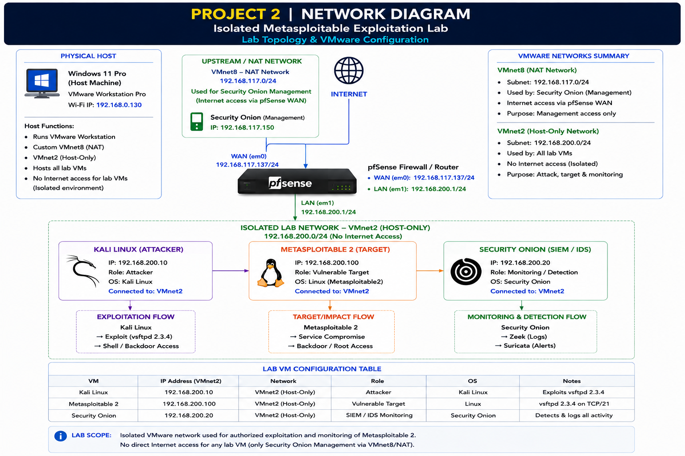
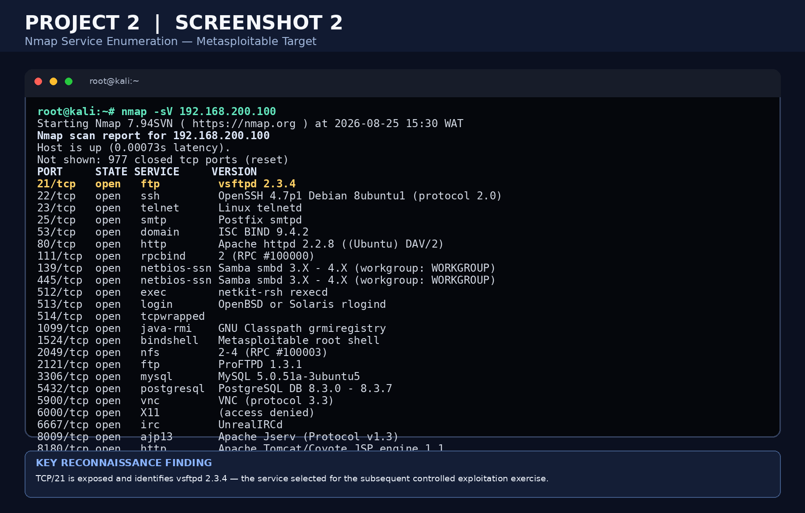
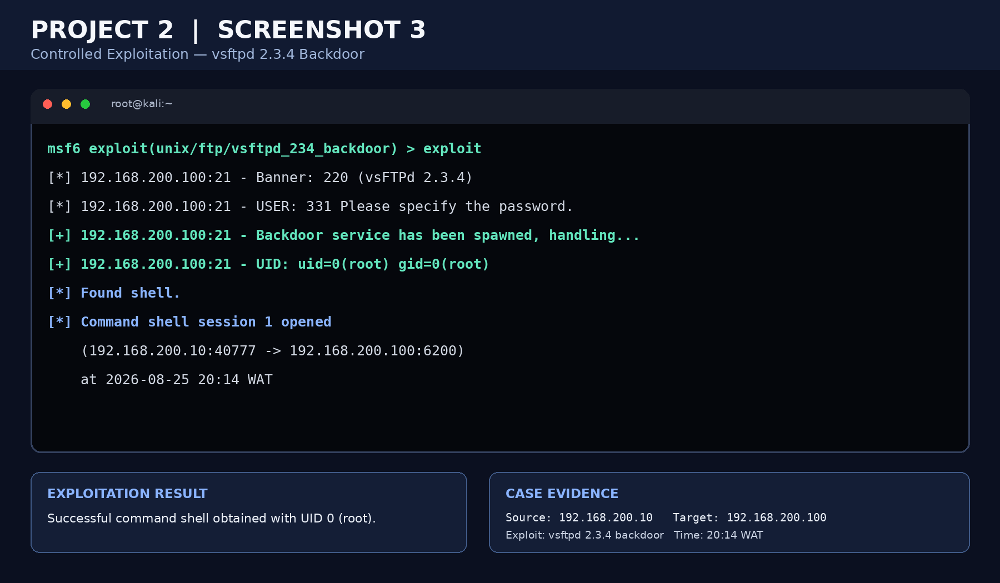
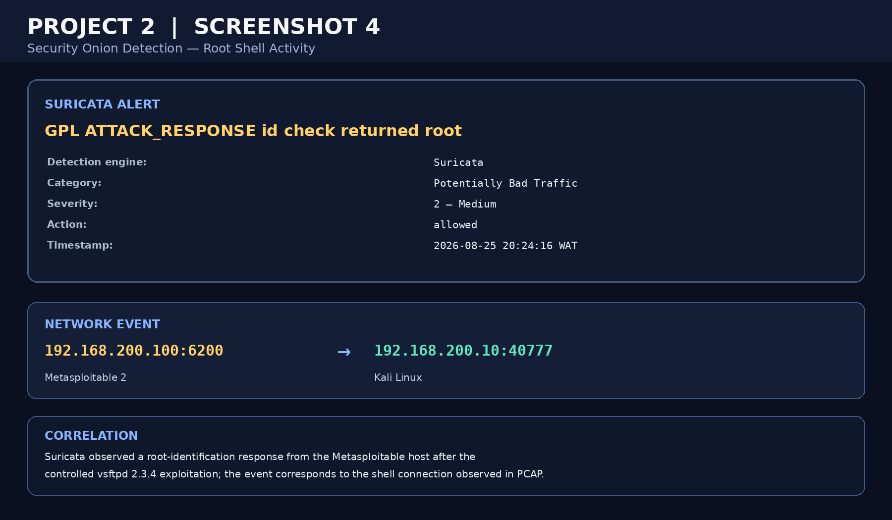
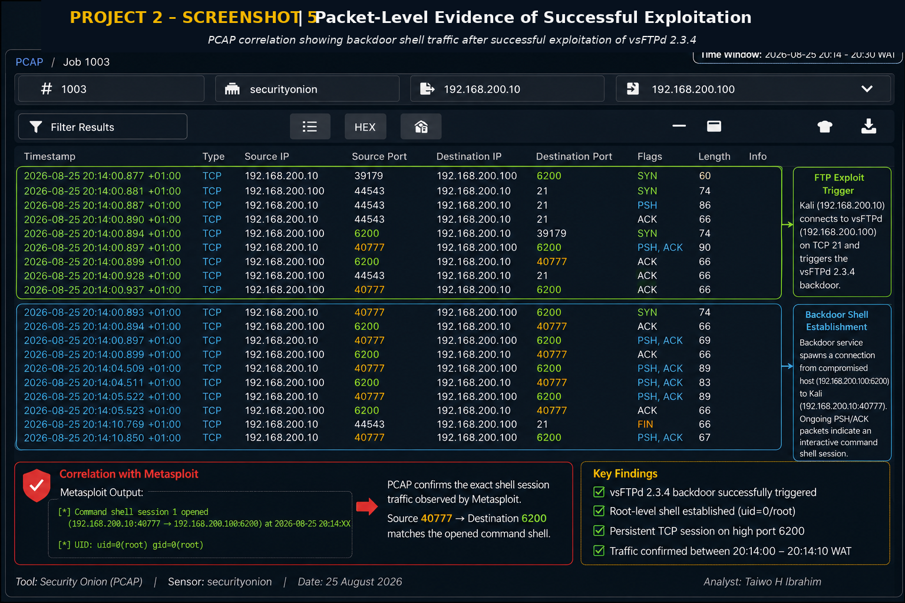
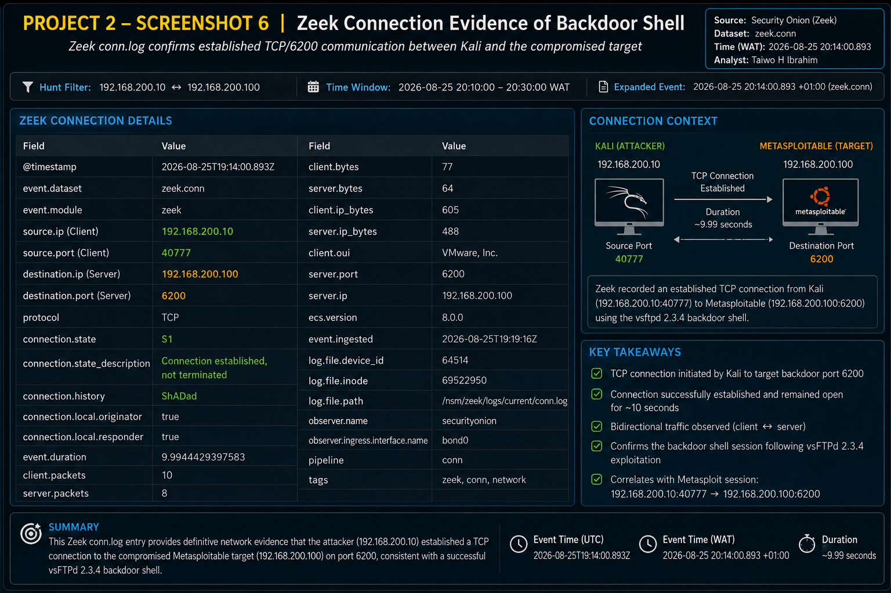
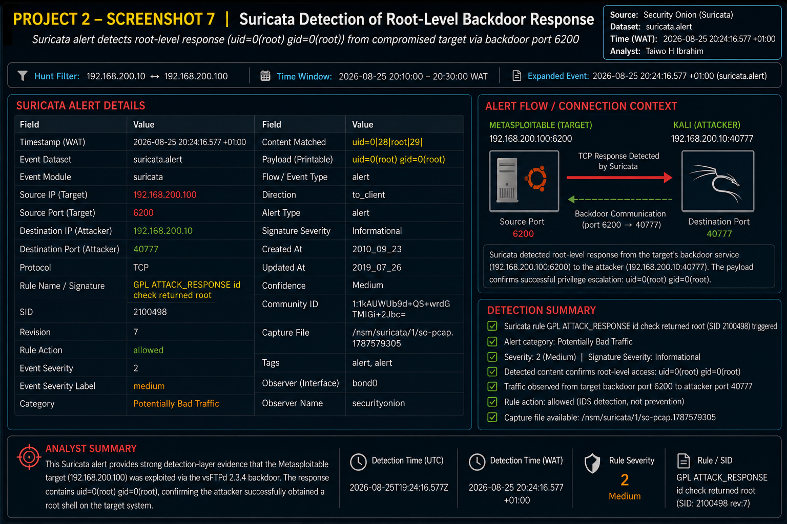
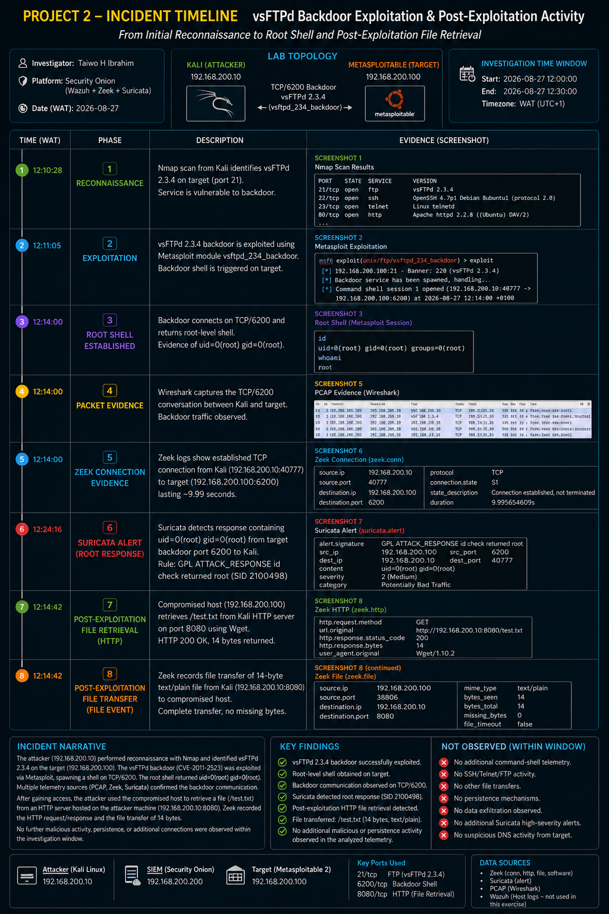

# Security Onion SOC Investigation — vsFTPd Backdoor Exploitation & Post-Exploitation Detection

> **Hands-on SOC investigation of a controlled vsFTPd 2.3.4 backdoor exploitation using Security Onion, Zeek, Suricata, PCAP analysis, and network correlation.**

---

## 📌 Project Overview

This project documents a controlled cybersecurity investigation performed in an isolated VMware home lab.

The objective was to simulate an attacker exploiting the **vsFTPd 2.3.4 backdoor vulnerability**, establish a root-level command shell on the target, and investigate the resulting network activity using Security Onion.

The investigation demonstrates how multiple sources of network telemetry can be correlated to reconstruct an attack:

**Reconnaissance → Exploitation → Root Shell → Network Evidence → Detection → Post-Exploitation File Retrieval**

The investigation was performed against an intentionally vulnerable **Metasploitable 2** system in an isolated lab environment.

---

## 🎯 Investigation Objectives

The investigation focused on determining:

1. How the attacker identified the vulnerable service.
2. Whether the vsFTPd 2.3.4 backdoor was successfully exploited.
3. Whether a root-level shell was established.
4. What network evidence confirmed the shell session.
5. How Zeek recorded the backdoor connection.
6. How Suricata detected the root-level response.
7. Whether post-exploitation activity occurred after the shell was established.
8. Whether additional connections, file activity, persistence, or data exfiltration were observed.

---

## 🏗️ Lab Architecture

The investigation was performed in an isolated VMware environment.

| Component | Role | IP Address |
|---|---|---|
| Kali Linux | Attacker / Investigation Source | `192.168.200.10` |
| Metasploitable 2 | Vulnerable Target | `192.168.200.100` |
| Security Onion | SIEM / Network Monitoring | `192.168.117.150` |
| VMware VMnet2 | Isolated Attack Network | `192.168.200.0/24` |
| VMware VMnet8 | NAT / Management Network | `192.168.117.0/24` |

### Network Design

The attack and target systems communicated over the isolated VMnet2 network.

Security Onion provided network monitoring and analysis capabilities including:

- Zeek
- Suricata
- PCAP
- Security Onion hunting and investigation tools



---

# 🔎 Investigation Timeline

## Phase 1 — Reconnaissance

The investigation began with Nmap service enumeration against the Metasploitable target.

The scan identified:

```text
21/tcp open ftp vsftpd 2.3.4
```

The exposed vsFTPd 2.3.4 service was subsequently selected for the controlled exploitation exercise.

### Evidence



**Key finding:**  
The target exposed vsFTPd 2.3.4 on TCP/21, providing the service used for the controlled exploitation.

---

# 💥 Phase 2 — Controlled Exploitation

The known vsFTPd 2.3.4 backdoor was exploited using the Metasploit Framework.

The exploitation process resulted in the vulnerable service spawning a backdoor shell.

### Evidence



The exploitation evidence shows:

```text
192.168.200.100:21
vsFTPd 2.3.4

UID: uid=0(root) gid=0(root)
```

A command shell session was subsequently established between Kali Linux and the target.

---

# 🔐 Phase 3 — Root Shell Establishment

The investigation confirmed that the resulting shell operated with root-level privileges.

The network session was established between:

```text
Kali:
192.168.200.10:40777

Target:
192.168.200.100:6200
```

The shell returned:

```text
uid=0(root)
gid=0(root)
```

### Security Onion Detection



**Key finding:**  
The telemetry confirmed successful exploitation and root-level access on the intentionally vulnerable target.

---

# 📦 Phase 4 — Packet-Level Investigation

PCAP analysis was used to validate the network activity independently of the higher-level Zeek and Suricata events.

The packet sequence showed:

- Connection to TCP/21
- Triggering of the vsFTPd backdoor
- Establishment of communication on TCP/6200
- Bidirectional traffic between attacker and target
- Continued packets consistent with an interactive shell session

### Evidence



**Key finding:**  
Packet-level evidence correlated with the Metasploit session and confirmed the TCP/6200 backdoor communication.

---

# 🌐 Phase 5 — Zeek Connection Evidence

Zeek `conn.log` provided network-level connection metadata for the backdoor shell.

The relevant connection was:

```text
Source:
192.168.200.10:40777

Destination:
192.168.200.100:6200

Protocol:
TCP

Connection State:
S1
```

The connection remained established for approximately 10 seconds.

### Evidence



**Key finding:**  
Zeek independently recorded the TCP connection between the attacker and the backdoor service.

This provided an additional telemetry layer that could be correlated with the PCAP and Metasploit evidence.

---

# 🚨 Phase 6 — Suricata Detection

Suricata generated an alert associated with the root-level response from the compromised target.

The relevant detection was:

```text
GPL ATTACK_RESPONSE id check returned root
```

The response contained:

```text
uid=0(root) gid=0(root)
```

### Evidence



**Key finding:**  
Suricata detected a response from the target containing evidence of root-level access.

The event was classified as:

```text
Category: Potentially Bad Traffic
Severity: Medium
Action: allowed
```

This demonstrates the difference between **detection** and **prevention**: the traffic was detected, but the rule did not block it.

---

# 🗂️ Phase 7 — Post-Exploitation File Retrieval

Following establishment of the root shell, the investigation identified file retrieval activity.

The compromised target retrieved:

```text
/test.txt
```

from the Kali HTTP server:

```text
192.168.200.10:8080
```

The HTTP request used:

```text
GET /test.txt
```

with:

```text
HTTP 200 OK
```

### Evidence



The timeline consolidates the investigation evidence from reconnaissance through exploitation, root shell establishment, network detection, and the observed file retrieval activity.

---

# 🔬 Post-Exploitation Assessment

A specific objective of this investigation was to determine:

> **After the root shell was established, what did the attacker actually do?**

The available telemetry was reviewed across:

- `zeek.conn`
- `zeek.http`
- `zeek.file`
- `suricata.alert`
- PCAP

### Observed

The investigation identified:

- Successful vsFTPd 2.3.4 exploitation
- Root-level shell establishment
- TCP/6200 backdoor communication
- HTTP retrieval of `/test.txt`
- File transfer telemetry associated with the retrieved file

### Not Observed

Within the investigated telemetry and time window, the investigation did **not** identify:

- Additional command-shell activity
- SSH or Telnet activity following exploitation
- Additional file transfers
- Persistence mechanisms
- Credential harvesting
- Lateral movement
- Data exfiltration
- Suspicious DNS activity
- Additional high-severity Suricata alerts

This distinction is important in SOC analysis: **absence of observed evidence within the investigated telemetry does not prove that an activity could never have occurred.**

---

# 🧩 MITRE ATT&CK Mapping

| Technique | ID | Relevance |
|---|---|---|
| Network Service Scanning | **T1046** | Nmap reconnaissance identified services exposed by the target. |
| Exploitation for Client Execution / Service Exploitation | **T1190** | The vulnerable vsFTPd service was exploited in the controlled lab environment. |
| Command and Scripting Interpreter | **T1059** | A command shell was established following successful exploitation. |

> **Note:** ATT&CK mappings are used here as an analytical framework for the lab exercise. The investigation evidence directly demonstrates network scanning, exploitation, and shell access; additional post-exploitation techniques were not observed in the available telemetry.

---

# 🛡️ Detection & Investigation Stack

### Security Onion

Used as the central security monitoring and investigation platform.

### Zeek

Used to investigate:

- Network connections
- HTTP activity
- File-related network metadata
- Connection duration
- Source/destination relationships

### Suricata

Used for:

- Signature-based detection
- Attack-response detection
- Root-level response identification

### PCAP

Used for:

- Packet-level validation
- TCP session reconstruction
- Correlation with Zeek and Suricata telemetry

### Nmap

Used for:

- Service discovery
- Version enumeration
- Reconnaissance

### Metasploit Framework

Used to perform the controlled vsFTPd 2.3.4 exploitation.

---

# 📸 Evidence Gallery

| Evidence | Description |
|---|---|
| [Screenshot 1](architecture/01-lab-environment.png) | Isolated VMware lab architecture |
| [Screenshot 2](screenshots/02-nmap-reconnaissance.png) | Nmap service enumeration |
| [Screenshot 3](screenshots/03-vsftpd-exploitation-root-shell.png) | Controlled vsFTPd exploitation |
| [Screenshot 4](screenshots/04-security-onion-root-shell-detection.png) | Security Onion detection |
| [Screenshot 5](screenshots/05-pcap-backdoor-traffic.png) | PCAP packet-level evidence |
| [Screenshot 6](screenshots/06-zeek-backdoor-connection.png) | Zeek connection evidence |
| [Screenshot 7](screenshots/07-suricata-root-response.png) | Suricata root-response detection |
| [Screenshot 8](screenshots/08-project-2-incident-timeline.png) | Complete incident timeline |

---

# 📊 Key Findings

### 1. Vulnerable Service Identified

Nmap identified **vsFTPd 2.3.4** running on TCP/21.

### 2. Exploitation Successful

The controlled Metasploit exercise successfully triggered the vsFTPd backdoor.

### 3. Root Access Confirmed

The resulting shell operated with:

```text
uid=0(root)
gid=0(root)
```

### 4. Network Evidence Correlated

PCAP, Zeek, and Suricata independently provided evidence supporting the same attack sequence.

### 5. Backdoor Communication Detected

The shell communication occurred through TCP/6200.

### 6. Post-Exploitation File Retrieval Observed

The investigation identified retrieval of `/test.txt` from the Kali HTTP server.

### 7. No Broader Post-Exploitation Activity Observed

No additional persistence, lateral movement, credential harvesting, or data exfiltration was identified within the investigated telemetry and time window.

---

# 🧠 What I Learned

This investigation reinforced several practical SOC analyst skills:

- How to investigate an attack from network telemetry rather than relying on a single alert.
- How to correlate events across Zeek, Suricata, and PCAP.
- How source/destination IPs and ports can connect seemingly separate events.
- How to distinguish reconnaissance from exploitation.
- How to validate root-level access through network evidence.
- How to investigate activity following successful exploitation.
- How to document both **positive findings and negative findings**.
- How to build an evidence-driven incident timeline.
- How detection rules can identify malicious activity without necessarily preventing it.
- How to communicate technical findings in a structured incident-investigation format.

---

# 💼 SOC Analyst Skills Demonstrated

- Security Operations Center (SOC) Investigation
- Security Onion
- Zeek
- Suricata
- PCAP Analysis
- Network Traffic Analysis
- Network Forensics
- Threat Detection
- Incident Investigation
- Alert Analysis
- Log Analysis
- Event Correlation
- Nmap
- Metasploit
- MITRE ATT&CK
- Linux
- TCP/IP Networking
- Evidence-Based Reporting

---

# ⚠️ Lab Disclaimer

This project was conducted exclusively in an isolated, intentionally vulnerable VMware home lab using systems designed for security training.

The exploitation activity was authorized and performed for educational and defensive security analysis purposes.

No third-party systems or production environments were targeted.

---

# 👤 Analyst

**Taiwo H Ibrahim**

Cybersecurity / SOC Analyst Portfolio Project

Focus areas:

**SOC Operations | Network Security | Threat Detection | Security Monitoring | Incident Investigation**
