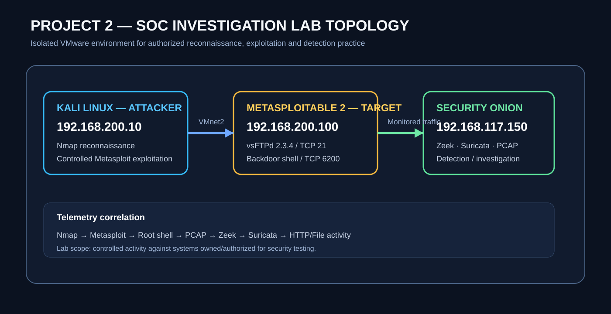

# Security Onion SOC Investigation — vsFTPd Backdoor Exploitation & Post-Exploitation Detection

Hands-on SOC investigation performed in an isolated VMware home lab using Kali Linux, Metasploitable 2 and Security Onion.

## Investigation flow

**Reconnaissance → Exploitation → Root Shell → PCAP Correlation → Zeek → Suricata → Post-Exploitation Investigation**

## Objective

Determine what happened after a controlled exploitation of the vulnerable vsFTPd 2.3.4 service and establish conclusions from correlated network evidence rather than assumptions.

## Lab

| System | Role | Address |
|---|---|---|
| Kali Linux | Attacker simulation | `192.168.200.10` |
| Metasploitable 2 | Deliberately vulnerable target | `192.168.200.100` |
| Security Onion | Detection and investigation | `192.168.117.150` |

## Key findings

- Nmap identified **vsFTPd 2.3.4 on TCP/21**.
- Controlled exploitation produced a command shell with **`uid=0(root) gid=0(root)`**.
- PCAP evidence showed backdoor shell traffic involving **TCP/6200**.
- Zeek independently recorded the established connection from `192.168.200.10:40777` to `192.168.200.100:6200`.
- Suricata generated **`GPL ATTACK_RESPONSE id check returned root`**, SID **2100498**, after observing the root-level response.
- A controlled post-exploitation test generated an HTTP request for **`/test.txt`** from `192.168.200.100` to `192.168.200.10:8080`, using **Wget/1.10.2**.
- The investigation therefore demonstrates both **successful root-shell establishment** and **one observable post-exploitation file-retrieval action**.

## What was not observed

The reviewed telemetry did not establish additional command-shell activity, persistence, additional file transfers beyond the documented `/test.txt` retrieval, or broader data exfiltration. These are reported as **not observed**, not as proof that they could never have occurred.

## Evidence

### 1. Lab environment

### 2. Nmap reconnaissance

### 3. Successful exploitation

### 4. Security Onion detection

### 5. Packet-level correlation

### 6. Zeek connection evidence

Zeek `conn` telemetry correlates the command-shell session with attacker IP `192.168.200.10`, source port `40777`, target IP `192.168.200.100`, and destination port `6200`.

### 7. Suricata root-level backdoor response

Suricata matched SID `2100498`, **GPL ATTACK_RESPONSE id check returned root**, after observing `uid=0(root) gid=0(root)` in the response.

### 8. Post-exploitation file retrieval

The controlled post-exploitation test generated an HTTP request for `/test.txt` to `192.168.200.10:8080` using `Wget/1.10.2`. This provides direct network evidence of file retrieval following compromise.

## MITRE ATT&CK mapping

| Technique | Use in this investigation |
|---|---|
| **T1046 — Network Service Scanning** | Nmap reconnaissance of the vulnerable target |
| **T1190 — Exploit Public-Facing Application** | Controlled exploitation of the exposed vsFTPd service in the lab |
| **T1059 — Command and Scripting Interpreter** | Command shell obtained after exploitation |
| **T1105 — Ingress Tool Transfer** | Controlled HTTP retrieval of `/test.txt` during the post-exploitation exercise |

> **Lab note:** ATT&CK mappings describe the simulated behaviors demonstrated in this controlled environment; they do not imply that every technique was performed against a real production system.

## SOC analyst assessment

The evidence supports a high-confidence finding of successful exploitation and root-level shell establishment because multiple independent telemetry sources corroborate the event:

1. Metasploit reported a root shell.
2. PCAP showed the corresponding TCP/6200 traffic.
3. Zeek recorded the connection.
4. Suricata independently detected the root-level response.

The subsequent `/test.txt` HTTP retrieval provides a separate, observable post-exploitation action. The reviewed telemetry did **not** establish persistence, privilege escalation beyond the root shell already obtained, or additional command execution.

## Skills demonstrated

**Security Onion · SOC Investigation · Network Security Monitoring · Zeek · Suricata · PCAP Analysis · Network Traffic Analysis · Packet Analysis · Threat Detection · Incident Investigation · Nmap · Metasploit · SIEM · Evidence Correlation · Incident Response · SOC Reporting · MITRE ATT&CK Mapping**

## What I learned

- How to correlate multiple telemetry sources instead of relying on a single alert.
- How Zeek `conn` records can establish communication relationships and ports involved in an intrusion.
- How Suricata signatures can identify meaningful payload content even when the underlying connection is otherwise a normal TCP session.
- How packet captures can validate SIEM/NSM observations.
- How to distinguish **detection** from **prevention**: the Suricata alert was marked `allowed`.
- How to document negative findings carefully: **not observed** is different from **did not happen**.
- How to turn raw SOC telemetry into a defensible incident narrative.

## Portfolio takeaway

This project demonstrates the ability to **collect, correlate, investigate and communicate security evidence** across multiple telemetry sources—not merely execute security tools.

## Scope

Authorized activity performed against deliberately vulnerable virtual machines in a controlled home-lab environment.
